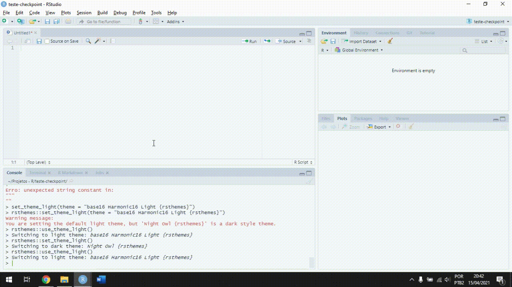

<style type="text/css">
  body {
  font-size: 16px;
  line-height: 1.5;
}
</style>

### Materiais

Por gentileza, faça o download dos materiais que iremos utilizar na reunião:

- [Banco de dados](link google frive)

- [Códigos](link google drive)

### Instalando R e RStudio

Para participar da reunião, você precisará estar com o R e o RStudio instalados e atualizados, de preferência nas versões mais recentes. A versão mais recente do R é 4.0.5 e você pode baixá-la [aqui](https://cran-r.c3sl.ufpr.br/). A versão mais recente do RStudio é 1.4.1106 e você pode baixá-la [aqui](https://www.rstudio.com/products/rstudio/download/#download).

Caso você tenha dúvidas, siga esse [tutorial](https://www.youtube.com/watch?v=6iZj3k9EBc4).

**Observação:** Instale o R e depois o RStudio.

Caso você já tenha o R e o RStudio instalados, você também pode atualizar o R e o RStudio diretamente pelo R seguindo esse [tutorial](https://uvastatlab.github.io/phdplus/installR.html).


### Instalando o Pandoc

Para algumas funções que iremos trabalhar, você precisará instalar um programa chamado **Pandoc**. Baixe o [instalador](https://pandoc.org/installing.html) e instale o programa no seu computador.

O R usará esse programa por baixo dos panos para executar algumas tarefas. Não precisaremos nos preocupar em utilizá-lo manualmente.


### Instalando os pacotes necessários

Iremos utilizar pacotes de funções que irão nos ajudar a ler o banco de dados e  construir e salvar as tabelas.

Com o R e o RStudio instalados/atualizados, abra o RStudio e, *mesmo que você já tenha algum desses pacotes instalados no seu computador*, execute os códigos:


```{r eval = FALSE, echo=TRUE, message=FALSE, warning=FALSE}
install.packages("readxl")
install.packages("tidyverse")
install.packages("gtsummary")
```


Não se preocupe com "letras vermelhas" ou *warnings*. Caso o R mostre algum erro (e.g., *Error in...*), verifique se o seu R e RStudio estão realmente atualizados e se você não cometeu nenhum erro ao digitar os códigos.

Para ver se o R está atualizado:

```{r eval = FALSE, echo=TRUE}
R.version.string
```

RStudio:

```{r eval=FALSE, echo=TRUE}
RStudio.Version()$version
```


Você também pode copiar e colar o erro no Google. Com certeza alguém já terá passado pelo mesmo problema.

Caso você não tenha encontrado uma solução, o Diego e a Jaqueline estarão disponíveis para ajudar você [por esse link](meet.google.com/cgj-armd-xtw) nos dias:

- 27/04, das 17:00 às 18:00 (Jaqueline) e 18:00 às 19:00 (Diego)

- 28/04, das 08:00 às 08:45 (Diego) e 09:00 às 09:30 (Jaqueline)


### Criando um projeto no R

Um projeto no R é uma pasta que contém um arquivo `.Rproj` e que será utilizada como um ambiente de trabalho para o R.

Não é necessário (mas nós **recomendamos**) fazer isso para a reunião, mas acostume-se a criar projetos para as suas análises. Projetos ajudam você a manter os arquivos relacionados as suas análises, bancos de dados e scripts de códigos em um só lugar.

Para criar um novo projeto:

<br>

```{r echo = FALSE}

```

<br>

Com o projeto criado, copie e cole os arquivos (por exemplo, o banco de dados e o `R script` que enviamos) para a pasta do projeto.

<br><br>

